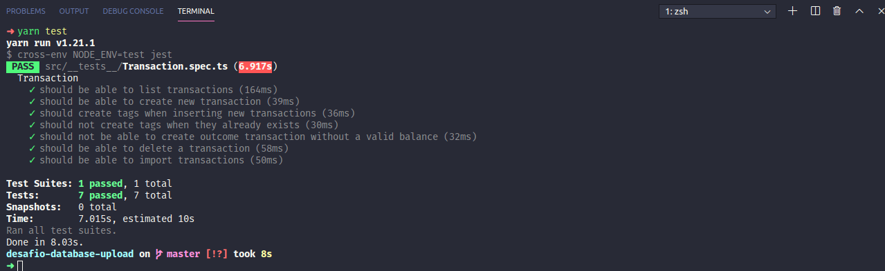

<h1 align="center">Desafio 06: Banco de dados e upload de arquivos no Node.js -  GoStack Turma 11</h1>

### Sobre o desafio

- Desafio 06 do bootcamp da Rocketseat onde continue desenvolvendo a aplicação de gestão de transações, incluindo o uso de banco de dados com o TypeORM e envio de arquivos com o Multer.

### Objetivo
- Criar uma  aplicação que deve armazenar transações financeiras de entrada e saída e permitir o cadastro e a listagem dessas transações, além de permitir a criação de novos registros no banco de dados a partir do envio de um arquivo csv.

### Testes
- Após a implementação os testes devem ser executados para que possa ser avaliado todos os pontos do desafio proposto.

- **`should be able to create a new transaction`**: Para que esse teste passe, sua aplicação deve permitir que uma transação seja criada, e retorne um json com a transação criado.

* **`should create tags when inserting new transactions`**: Para que esse teste passe, sua aplicação deve permitir que ao criar uma nova transação com uma categoria que não existe, essa seja criada e inserida no campo category_id da transação com o `id` que acabou de ser criado.

- **`should not create tags when they already exists`**: Para que esse teste passe, sua aplicação deve permitir que ao criar uma nova transação com uma categoria que já existe, seja atribuído ao campo category_id da transação com o `id` dessa categoria existente, não permitindo a criação de categorias com o mesmo `title`.

* **`should be able to list the transactions`**: Para que esse teste passe, sua aplicação deve permitir que seja retornado um array de objetos contendo todas as transações junto ao balanço de income, outcome e total das transações que foram criadas até o momento.

- **`should not be able to create outcome transaction without a valid balance`**: Para que esse teste passe, sua aplicação não deve permitir que uma transação do tipo `outcome` extrapole o valor total que o usuário tem em caixa (total de income), retornando uma resposta com código HTTP 400 e uma mensagem de erro no seguinte formato: `{ error: string }`.

* **`should be able to delete a transaction`**: Para que esse teste passe, você deve permitir que a sua rota de delete exclua uma transação, e ao fazer a exclusão, ele retorne uma resposta vazia, com status 204.

- **`should be able to import transactions`**: Para que esse teste passe, sua aplicação deve permitir que seja importado um arquivo csv, contendo o seguinte [modelo](./assets/file.csv). Com o arquivo importado, você deve permitir que seja criado no banco de dados todos os registros e categorias que estavam presentes nesse arquivo, e retornar todas as transactions que foram importadas.

### Resultado dos testes:

**Rocketseat!! GoStack11!! Desafio06 NodeJS!!**
